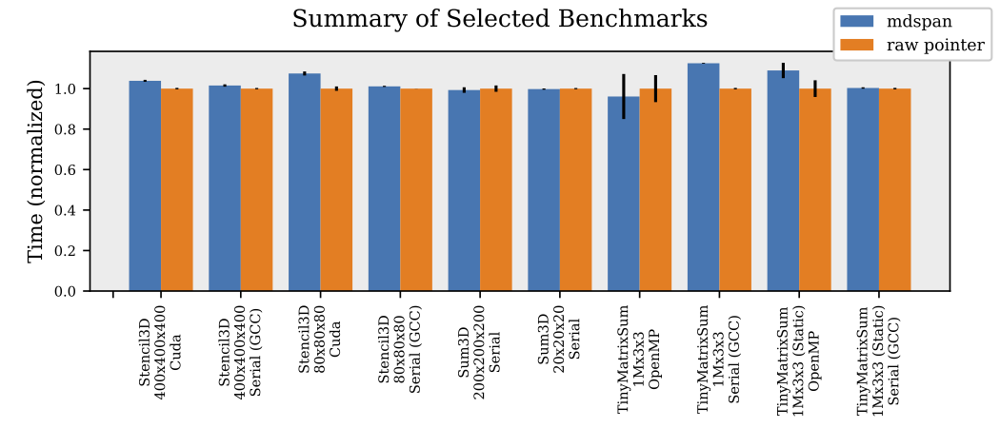
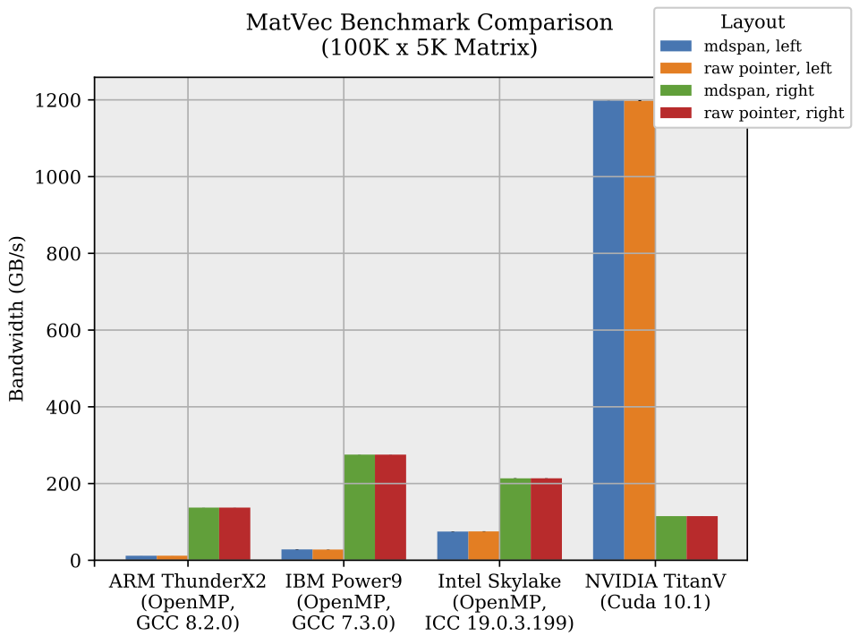
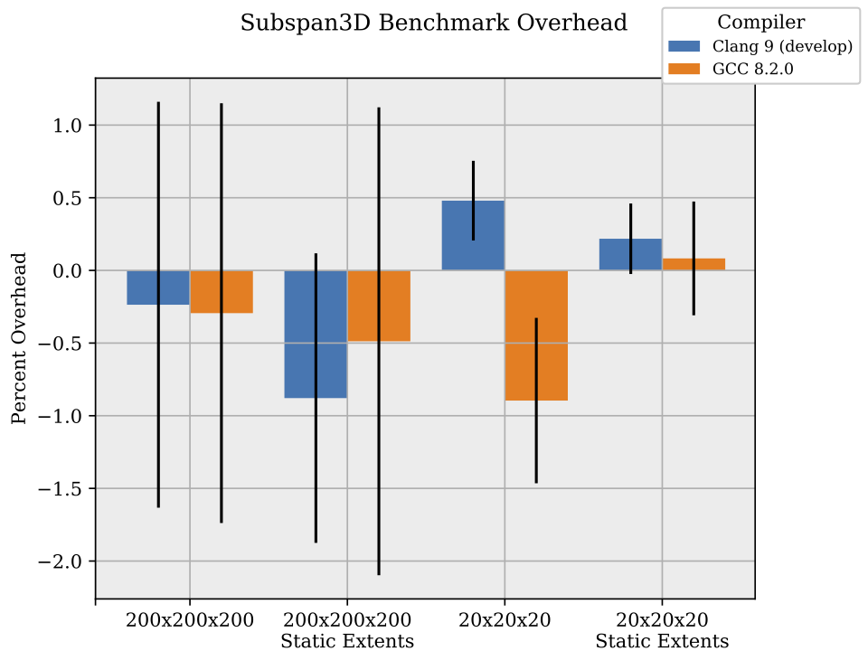

<!-- .slide: class="title-slide snl-slide" -->

<!-- ################################################################################ -->

---
<!-- .slide: class="content-slide snl-slide" style="font-size: 100%" --> 

@snap[north span-100 slide-title]
### Follow along! <!-- {{{2 -->
@snapend

## [dsh.fyi/TODO](https://dsh.fyi/p3hpc-19)

<div class="space-3"></div>


<!-- }}}2............................................................................ -->

---
<!-- .slide: class="content-slide snl-slide" style="font-size: 100%" --> 

@snap[north span-100 slide-title]
### Disclaimer <!-- {{{2 -->
@snapend

@box[proposal-box rounded span-70-center](Disclaimer#This presentation contains some C++ source code.)

<!-- }}}2............................................................................ -->

---
<!-- .slide: class="content-slide snl-slide" style="font-size: 100%" --> 

@snap[north span-100 slide-title]
### Outline <!-- {{{2 -->
@snapend

@ul
* Introduction
* Design Overview
  * Shape and Indexing
  * `subspan`
  * Layout Customization
  * Accessor Customization
* Benchmarks
  * Overview
  * Matrix Vector Multiply
  * Subspan Abstraction Overhead
* Concluding Remarks
@ulend

<!-- }}}2............................................................................ -->

---
<!-- .slide: class="content-slide snl-slide" style="font-size: 100%" --> 

@snap[north span-100 slide-title]
### Introduction <!-- {{{2 -->
@snapend

@ul
* `mdspan` is a non-owning multidimentional array view for C++23.
* Proposal: P0009R9, [http://wg21.link/P0009R9](http://wg21.link/P0009R9)
  * First submitted to Autumn 2015 meeting
  * Design approved for C++23
  * Currently under wording review
* Support for arbitrary (rectangular) shapes, mixing of static and runtime extents, layout customization, and memory access customization
@ulend


<!-- }}}2............................................................................ -->

---
<!-- .slide: class="content-slide snl-slide" style="font-size: 100%" --> 

## Design Overview <!-- {{{1 -->

<!-- ................................................................................ -->


<!-- }}}1............................................................................ -->

---
<!-- .slide: class="content-slide snl-slide" style="font-size: 100%" --> 

@snap[north span-100 slide-title]
### Basic Usage <!-- {{{2 -->
@snapend

```c++
void some_function(double* data, float* data2) {

  // std::dynamic_extent means it's a dimension given at runtime
  auto my_matrix = mdspan<double, dynamic_extent, dynamic_extent>(data, 20, 40);

  // runtime and compile-time dimensions can be mixed
  auto other_matrix = mdspan<float, 20, dynamic_extent>(data2, 40);

  /* ... */

  my_matrix(17, 34) = 3.14;
  other_matrix(0, 12) = my_matrix(17, 34);
}
```

@[3-4](View `data` as a 20x40 matrix of doubles (runtime extents&rpar;)
@[6-7](Mixed compile-time and runtime dimensions)
@[11-12](Access to values uses the parenthesis operator)
@[1-13]()

<!-- }}}2............................................................................ -->

---
<!-- .slide: class="content-slide snl-slide" style="font-size: 100%" --> 

@snap[north span-100 slide-title]
### `mdspan` is short for `basic_mdspan` <!-- {{{2 -->
@snapend

```c++
template <typename T, ptrdiff_t... Exts>
using mdspan = basic_mdspan<T, extents<Exts...>>;
```
<!-- .element: class="span-60" -->

<div class="space-3"></div>

@ul
* `mdspan` is just an alias for `basic_mdspan` (just like `string` is an alias for `basic_string`)
* `std::extents` is a class template that expresses the shape of the `mdspan`.
@ulend

<!-- }}}2............................................................................ -->

---
<!-- .slide: class="content-slide snl-slide" style="font-size: 100%" --> 

@snap[north span-100 slide-title]
### `subspan`  <!-- {{{2 -->
@snapend

```c++
auto s = mdspan<double, 3, 4, 5>(data);
s(1, 2, 3) = 2.78;
auto s2 = subspan(s, 1, pair{1, 3}, all);
assert(s2(1, 3) == s(1, 2, 3));
```
<!-- .element: class="span-60" -->

<div class="space-3"></div>

@ul
* Supports three different types of slices:
  * A single index
  * A pair of begin and end
  * The `all` slice
@ulend

<!-- }}}2............................................................................ -->

---
<!-- .slide: class="content-slide snl-slide" style="font-size: 100%" --> 

@snap[north span-100 slide-title]
### Layout Customization <!-- {{{2 -->
@snapend

@ul
* The optional third template parameter to `basic_mdspan` is a `LayoutPolicy`
* `LayoutPolicy` is a customization point that lets the user control how multi-indices are translated into memory offsets.
* The proposal provides three layout policies:
   * `layout_left` (FORTRAN ordering)
   * `layout_right` (C ordering)
   * `layout_stride` (regularly strided dimensions)
* The customization point is flexible enough to support things like
   * tiled layouts
   * various forms of symmetric layouts
   * sparse layouts
   * compressed layouts (with the help of an `AccessorPolicy`)
@ulend

<!-- }}}2............................................................................ -->

---
<!-- .slide: class="content-slide snl-slide" style="font-size: 100%" --> 

@snap[north span-100 slide-title]
### Accessor Customization <!-- {{{2 -->
@snapend

@ul
* The optional fourth template parameter to `basic_mdspan` is an `Accessor`
* The `Accessor` customization point provides:
   * The reference type to be returned by `basic_mdspan::operator()`
   * The pointer type through which access occurs
   * A function for converting a pointer and an offset into a reference
* With these tools, you can write accessors that do things like:
   * Expose non-aliasing semantics (i.e., like `restrict` in C)
   * Access remote memory
   * Access data stored in a compressed format of some sort
   * Access data atomically (using P0019, `atomic_ref`)
@ulend

<!-- }}}2............................................................................ -->

---
<!-- .slide: class="content-slide snl-slide" style="font-size: 100%" --> 

## Benchmarks <!-- {{{1 -->

<!-- ................................................................................ -->

---
<!-- .slide: class="content-slide snl-slide" style="font-size: 100%" --> 

@snap[north span-100 slide-title]
### `Sum3D` <!-- {{{2 -->
@snapend

@code[c++](snippets/sum3d.cpp)
<!-- .element: class="span-60" -->

<div class="space-3"></div>

@code[c++](snippets/sum3d_raw.cpp)
<!-- .element: class="fragment span-60" -->

<!-- }}}2............................................................................ -->

---
<!-- .slide: class="content-slide snl-slide" style="font-size: 100%" --> 

@snap[north span-100 slide-title]
### Comparison to Raw Pointer <!-- {{{2 -->
@snapend




<!-- }}}2............................................................................ -->

---
<!-- .slide: class="content-slide snl-slide" style="font-size: 100%" --> 

@snap[north span-100 slide-title]
### Effect of Layout on `MatVec` <!-- {{{2 -->
@snapend


<!-- .element: class="span-60" -->


<!-- }}}2............................................................................ -->

---
<!-- .slide: class="content-slide snl-slide" style="font-size: 100%" --> 

@snap[north span-100 slide-title]
### `Subspan3D`: Abstraction Overhead Stress Test <!-- {{{2 -->
@snapend

@code[c++](snippets/subspan3d.cpp)
<!-- .element: class="span-60" -->


<!-- }}}2............................................................................ -->

---
<!-- .slide: class="content-slide snl-slide" style="font-size: 100%" --> 

@snap[north span-100 slide-title]
### `Subspan3D` Overhead <!-- {{{2 -->
@snapend


<!-- .element: class="span-70" -->

<!-- }}}2............................................................................ -->

<!-- }}}1............................................................................ -->

---
<!-- .slide: class="content-slide snl-slide" style="font-size: 100%" --> 

## Concluding Remarks <!-- {{{1 -->

<!-- ................................................................................ -->

---
<!-- .slide: class="content-slide snl-slide" style="font-size: 100%" --> 

@snap[north span-100 slide-title]
### Concluding Remarks <!-- {{{2 -->
@snapend

@ul
* `mdspan` provides *standard* C++ multidimensional array support (finally) 
* The `LayoutPolicy` and `Accessor` customization points allow adaptation to a diverse set of use cases
* Benchmarks demonstrate that the abstraction comes with zero overhead in most scenarios and with most compilers
* Implementation is available at [github.com/kokkos/mdspan](https://github.com/kokkos/mdspan).
  * Our implementation is backported all the way to C++11 (though it will use C++14 or C++17 to improve compilation times if available)
  * We plan to submit this implementation as pull requests to the three major standard library implementations upon final acceptance of `mdspan` into C++23
  * Feedback is appreciated!
@ulend

<!-- }}}2............................................................................ -->

---
<!-- .slide: class="content-slide snl-slide" -->

# Questions?


<!-- }}}1............................................................................ -->
